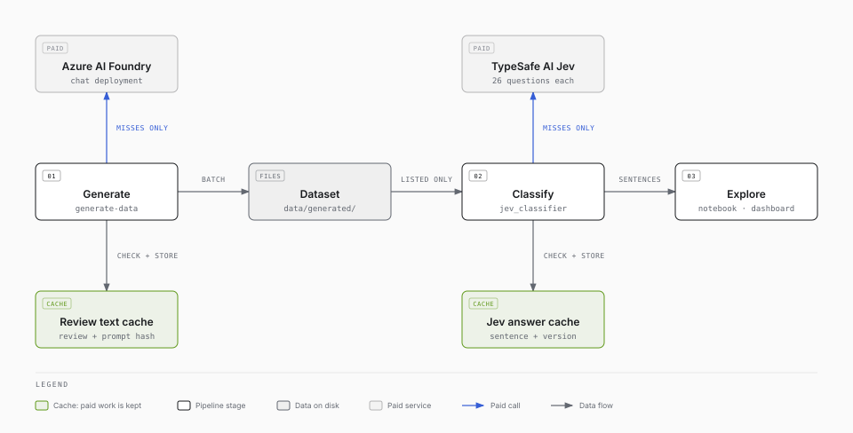
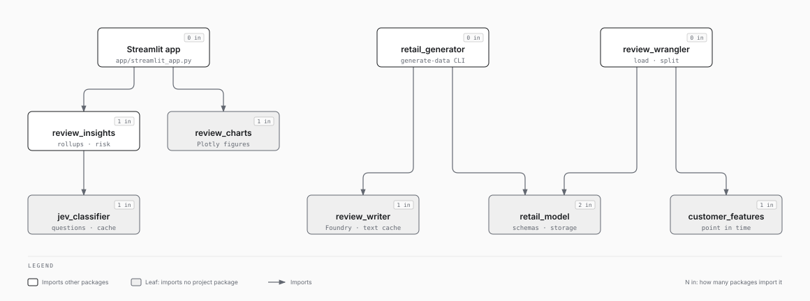
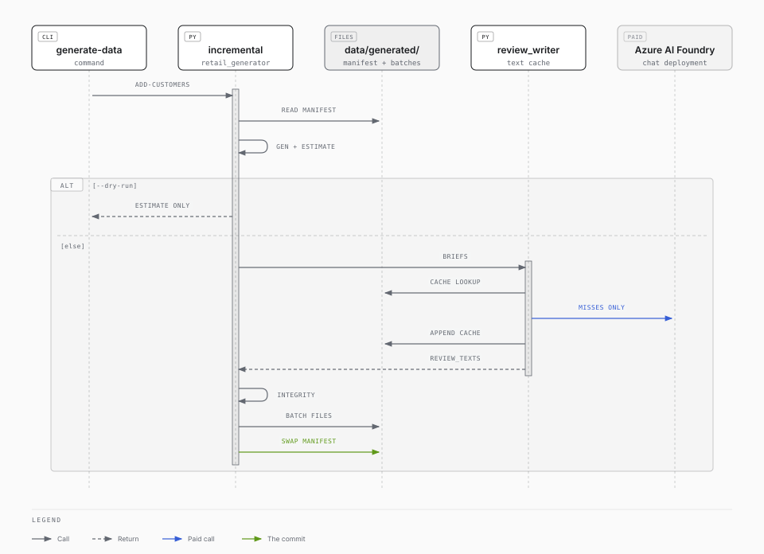

# Architecture

How the pieces fit together, where data lives, and the decisions that shape the code. For the tables themselves, see [`data-model.md`](data-model.md). For what the system must do, see [`requirements.md`](requirements.md).

## The pipeline

The demo is a batch pipeline in four stages. Every stage writes Parquet, so any stage can be rerun without repeating the ones before it, and each external call is cached so a rerun costs nothing.

Classification can be done two ways: by TypeSafe AI's Jev, or by a foundation model on Azure AI Foundry through DSPy. The two are interchangeable (see [Two classifiers, side by side](#two-classifiers-side-by-side)), and an optional comparison runs both on the same sentences.

<picture>
  <source media="(prefers-color-scheme: dark)" srcset="diagrams/pipeline-dark.svg">
  
</picture>

*The stages run left to right, each handing the next a Parquet file. Each paid service is reached only through a cache (green), so a rerun pays only for what is new. Classify calls Jev or, through DSPy, the same Foundry deployment that writes the reviews. Compare runs both live and uncached, so their timings are fair. Not shown: the Foundry endpoint and key come from `.env`.*

| Stage | Entry point | Reads | Writes | External service |
|---|---|---|---|---|
| 1. Generate | `uv run generate-data …`, or notebook section 1 | `reference_data/products.csv` | `data/generated/` | Azure AI Foundry (review text) |
| 2. Load and split | Notebook sections 2–3 | `data/generated/` | In memory | None |
| 3. Classify | Notebook section 4 (Jev); `dspy_classifier.classify_sentences` for the foundation model | Sentences | `data/output/jev_sentence_answers.parquet` (cache), `data/output/sentences_classified.parquet` | TypeSafe AI Jev, or Azure AI Foundry through DSPy |
| 4. Explore | `uv run streamlit run app/streamlit_app.py`, or notebook section 5 | `data/output/sentences_classified.parquet` | Nothing | None |
| Compare (optional) | `notebooks/02_compare_jev_and_foundry.ipynb` | Sentences, `review_truth` | `data/output/comparison/` | TypeSafe AI Jev and Azure AI Foundry (through DSPy), live and uncached |

The notebook [`notebooks/01_classify_reviews_with_jev.ipynb`](../notebooks/01_classify_reviews_with_jev.ipynb) runs stages 1 to 3 and the analysis half of stage 4. It contains no logic of its own: every cell calls a function in `src/`.

## Packages

Each package under `src/` has one job. Dependencies only point one way, and the packages that model the domain know nothing of the services or the UI.

<picture>
  <source media="(prefers-color-scheme: dark)" srcset="diagrams/packages-dark.svg">
  
</picture>

*Each arrow points from a package to one it imports, and each badge counts a package's importers. Every arrow points downwards, so there are no cycles. Three leaf packages are shared by two importers: `retail_model`; `jev_classifier`, whose question set `dspy_classifier` reuses; and `review_writer`, whose Foundry settings it reuses. The notebooks sit outside the diagram and may import any package.*

| Package | Responsibility | Key modules |
|---|---|---|
| `retail_model` | Table schemas (pandera), cross-table integrity rules, review propensity, reading and writing a dataset | `tabular_schemas.py`, `integrity.py`, `storage.py`, `review_propensity.py` |
| `retail_generator` | Deterministic customers, orders and reviews; incremental batches; cost estimates; the `generate-data` CLI | `config.py` (every knob), `customers.py`, `orders.py`, `reviews.py`, `incremental.py`, `estimate.py`, `cli.py` |
| `review_writer` | Turn a review brief into text with Azure AI Foundry, settings from `.env`, cached by prompt | `prompt.py`, `writers.py`, `model_secrets.py`, `text_cache.py` |
| `customer_features` | Point-in-time customer features: only data from strictly before each review | `point_in_time.py`, `review_features.py` |
| `review_wrangler` | Load one row per review with text, product and features; split into sentences | `review_loader.py`, `sentence_splitter.py` |
| `jev_classifier` | The question set, async classification with a Parquet cache, and a wire transcript for debugging | `questions.py`, `sentence_classifier.py`, `transcript.py` |
| `review_insights` | Roll sentences up to reviews and customers; Sankey flows, risk tiers, escalation and review queues | `review_insights.py`, `customer_view.py` |
| `review_charts` | Plotly figures and colour roles for the dashboard | `charts.py`, `palette.py` |
| `dspy_classifier` | Jev's questions asked of a foundation model on Azure AI Foundry through DSPy, as a drop-in alternative to `jev_classifier`; and the comparison of the two | `signature.py`, `sentence_classifier.py`, `foundry.py`, `comparison.py` |
| `app/streamlit_app.py` | The dashboard: layout, filters and state only | |

All nine packages are registered in `pyproject.toml` (`[tool.hatch.build.targets.wheel]`), so they import by name from anywhere: the notebook, the app and the tests need no `sys.path` changes. A new package must be added to that list.

## Two classifiers, side by side

`jev_classifier` and `dspy_classifier` answer the same 26 questions about the same sentences, and return the same rows. Either can feed `review_insights`, and `dspy_classifier.comparison` can measure any two result frames against each other.

| | Jev (`jev_classifier`) | Foundation model (`dspy_classifier`) |
|---|---|---|
| Model | TypeSafe AI's Jev, a *System One* model built to answer typed questions | Any chat deployment on Azure AI Foundry; by default the one that writes the reviews |
| Questions | `questions.build_questions`, versioned by `QUESTION_SET_VERSION` | A DSPy signature built from the same `build_questions`, never written by hand, so a changed question reaches both |
| Input | `questions.build_state`: the sentence and its whole review, never the rating or the customer | The same `build_state` |
| How it is asked | One request per sentence, with every question typed (`Score`, `Choice`, `Noul`) | One zero-shot `dspy.Predict` call per sentence, answering every question as typed output fields |
| Output | `RESULT_SCHEMA`, one row per sentence | `RESULT_SCHEMA` plus `output_tokens`, with out-of-range answers clipped; `jev_model` names the model |
| Confidence | Measured: probabilities over the labels | Reported by the model, in the same columns, and not calibrated |
| Cache key | `review_key` + `sentence_index` + `question_set_version` | The same, plus the model, so answers from several models share a file without being mixed up |
| Cost | Input tokens only | Input and output tokens; a reasoning model's hidden thinking is billed as output and dominates |

Three rules keep the comparison fair. Both classifiers are built from one question set and one state, so they are asked the same thing. Both use `KEY` and one result schema, so `agreement` and `accuracy` pair their answers row for row. And notebook 02 runs both live, uncached, on one stratified sample at one concurrency, so the timings are like for like. It saves each run to `data/output/comparison/` so the analysis can be repeated without paying again, and records the foundation model's reasoning effort with its timings.

The DSPy side has two constraints of its own, both in `foundry.py`. It is pinned to DSPy's `lm15` engine, because the `litellm` engine does not import alongside `openai` 3.x. And so it needs Foundry's `v1` API: dated Azure OpenAI versions route through `litellm`.

## Where data lives

| Path | What | In git? | Safe to delete? |
|---|---|---|---|
| `reference_data/products.csv` | The 17-product catalogue | Yes | No: the generator needs it |
| `data/generated/manifest.json` | Seed, `as_of`, config hash and every committed batch | No | Yes, with the rest of `data/generated/`: the dataset regenerates from the seed |
| `data/generated/<table>/batch-NNNN.parquet` | One file per table per batch | No | As above |
| `data/generated/review_text_cache.parquet` | Every review text Foundry has written, keyed on `review_id` + `prompt_hash` | No | **Costly**: deleting it means paying Foundry to write every text again |
| `data/output/jev_sentence_answers.parquet` | Every Jev answer, keyed on `review_key` + `sentence_index` + `question_set_version` | No | **Costly**: deleting it means paying Jev to classify every sentence again |
| `data/output/sentences_classified.parquet` | The flat result the dashboard reads | No | Yes: the notebook rewrites it from the cache |
| `data/output/comparison/` | The saved live runs of each classifier from notebook 02, with their timings | No | **Costly**: deleting them means paying both services again to repeat the comparison |
| `.env` | `TYPESAFE_API_KEY`, and the Foundry endpoint, key, deployment and API version | No | No: copy it from `.env.example` |

## Cross-cutting design

### Determinism

The same seed gives identical structured data, however it was built up. Every entity draws from its own random stream, keyed on the seed, a stream name and the entity's number (`random_streams.rng(seed, "customer", 1234)`). So:

- Customer 1,234 is the same whether it was generated alone, in a batch of 10,000, or in the third of several batches.
- Adding a random draw to one stream never shifts another.
- Simulating a customer to a later date reproduces their earlier history exactly and then continues it.

Language models are not deterministic, so review text is made reproducible by caching instead. The prompt is rendered deterministically from the brief, and `prompt_hash` covers the model and the prompt. The same seed gives the same briefs, the same hashes, and therefore the same cached text.

### Caching and cost control

Both paid services sit behind a Parquet cache, and every cache key includes whatever would change the answer:

| Cache | Key | Invalidated by |
|---|---|---|
| Review text | `review_id` + `prompt_hash` (model + system prompt + rendered brief) | A different deployment, a changed prompt, or a changed brief |
| Jev answers | `review_key` (product + text) + `sentence_index` + `question_set_version` | Changing a question in `questions.py`, which must come with a bump to `QUESTION_SET_VERSION` |
| Foundation-model answers (when a `cache_path` is given) | As for Jev, plus the model (`jev_model`) | As for Jev, or switching deployment. Other models' answers stay in the file, ready if you switch back |

Before any batch is written, `estimate.py` reports the tokens, cost and time it will take for both services. `--dry-run` reports without writing.

### How a batch is committed

Every `generate-data` command that changes the dataset (`add-customers`, `advance` and `fill-texts`) goes through the same commit in `retail_generator/incremental.py`:

<picture>
  <source media="(prefers-color-scheme: dark)" srcset="diagrams/batch-commit-dark.svg">
  
</picture>

*Swapping in the new manifest (a write to `manifest.json.tmp`, then a rename) is the commit. A run that stops at any earlier step leaves files that no manifest lists, so readers never see them, and the next run deletes and rewrites them. The text cache is written before the commit, so text that was paid for survives a crash.*

### Failure handling

A failed external call is never papered over:

- **Foundry:** a failed review text is reported, not cached, and retried on the next batch or by `generate-data fill-texts`. The review stays in the dataset, and the loader leaves it out and prints how many it left out.
- **Jev and the foundation model:** a failed sentence gets a row with the error and nulls. It is not cached, so the next run retries it, and the comparison leaves it out of agreement rather than counting it as a disagreement.
- **Batches are atomic:** files are written first and `manifest.json` last, so readers never see a half-written batch, and the next run replaces its files. See [How a batch is committed](#how-a-batch-is-committed).

### Validation at the boundaries

Every table is validated against its pandera schema whenever it is written or read. The whole dataset is then checked against the cross-table rules in `integrity.py` before a batch is committed. A hand-edited or half-written file therefore fails at the boundary, with a message naming the rule, rather than deep in the pipeline.

### No leakage

Two rules keep the data honest for machine learning and for evaluation:

- **Point in time.** Every customer feature is computed by `point_in_time`, an as-of join that only admits events strictly before the review. A test appends huge future orders and reviews and checks that no feature moves.
- **Truth is separate.** `review_truth` holds what the generator intended: the hidden satisfaction, the aspect and the language. It lives in its own table so that using it is deliberate, and it is only for scoring the classifiers.

Neither classifier is sent the star rating or the customer's demographics: both build their input with `questions.build_state`. That keeps "does frustration track the stars?" a fair test of either model.

### Secrets

- `.env` holds `TYPESAFE_API_KEY` and the Foundry endpoint, key, deployment and API version. It is gitignored, and `.env.example` holds only placeholders.
- The Foundry settings are in `.env`, not a key vault, so the demo runs for someone given only an endpoint and a key, with no Azure identity of their own. Each model role is a set of variables sharing a prefix (`KG_REFLECTION_MODEL_ENDPOINT`, `_KEY`, `_DEPLOYMENT`, `_API_VERSION`), read by `review_writer.model_settings(prefix)`.
- `ModelSettings.__repr__` never prints the key, and the Jev transcript never records request headers.
- Generated customers use Faker's reserved example domains, so no generated email can reach a real inbox.

### Testing

`uv run pytest` runs the unit tests in `tests/unit/`, which never call a live service. Foundry is replaced by `tests/unit/stub_writer.py` or a mock HTTP transport, Jev by stub responses, and the DSPy classifier's model by a stub engine. The tests prove the properties above directly: two batches equal one, advancing time equals generating straight to the later date, an interrupted batch is invisible, future data cannot move a feature, failures are never cached, and the API key is never printed.

## Extending the demo

| To… | Change | Then |
|---|---|---|
| Ask a new question, or reword one | `src/jev_classifier/questions.py` | Bump `QUESTION_SET_VERSION`. If it needs its own column, add it to `RESULT_SCHEMA` and to `CHOICES` or `NOULS` in `sentence_classifier.py`: both classifiers' `flatten` read those lists. The DSPy signature picks the question up by itself. |
| Change a buying pattern, rate or date | `src/retail_generator/config.py` | Start a new dataset directory: the config hash is in the manifest, and a changed config is refused for an existing dataset. |
| Add a product | `reference_data/products.csv`, plus its quality in `ReviewContent.product_quality` (and popularity or accessory weights if relevant) | Start a new dataset. Jev's mention questions pick the product up automatically. |
| Add a country or language | `COUNTRIES` in `tabular_schemas.py`, `LOCALES` and `local_language` in `config.py`, `LANGUAGE_NAMES` in `review_writer/prompt.py` | Add it to Jev's `LANGUAGES` if Jev should recognise it. |
| Use a different Foundry model | Change `KG_REFLECTION_MODEL_DEPLOYMENT` (and the endpoint and key, if it is on another resource) in `.env` | Text is rewritten (the hash includes the model). The old text stays cached in case you switch back. |
| Write review text another way | Implement the `ReviewWriter` protocol (`model`, `write`, `aclose`) in `review_writer/writers.py` | |
| Compare Jev with another foundation model | Add its settings to `.env` under a new prefix (`KG_<ROLE>_MODEL_ENDPOINT`, `_KEY`, `_DEPLOYMENT`), and build its LM with `foundry_lm(model_settings("KG_<ROLE>_MODEL"))` | Its answers are cached separately: the cache key includes the model. |
| Split sentences properly | Replace `review_wrangler/sentence_splitter.py` | Nothing downstream depends on how the split was made. |
| Add a dashboard view | Build the frame in `review_insights` and the figure in `review_charts` | Keep `app/streamlit_app.py` to layout and state. |

## Known limitations

- **The sentence splitter is a regex.** It handles `.`, `!`, `?` and full-width `。！？`, which is enough for generated text. Real reviews with abbreviations, decimals or quotations need a proper segmenter.
- **Everything runs on one machine.** Polars in memory is comfortable to 100,000 customers (about 30 MB of Parquet). Classification time and cost are the real limits; see the sizing table in the [README](../README.md).
- **Colours are validated for the light theme only**, so `.streamlit/config.toml` pins it.
- **Currency is not modelled.** Prices are plain numbers.
