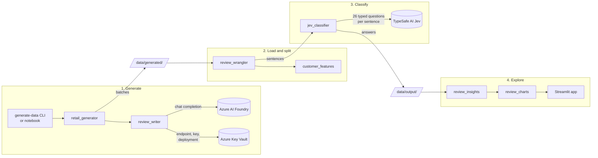
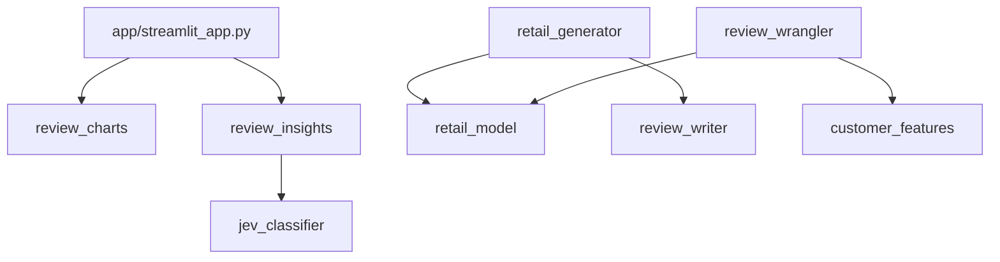

# Architecture

How the pieces fit together, where data lives, and the decisions that shape the code. For the tables themselves, see [`data-model.md`](data-model.md). For what the system must do, see [`requirements.md`](requirements.md).

## The pipeline

The demo is a batch pipeline in four stages. Every stage writes Parquet, so any stage can be rerun without repeating the ones before it, and each external call is cached so a rerun costs nothing.

| Stage | Entry point | Reads | Writes | External service |
|---|---|---|---|---|
| 1. Generate | `uv run generate-data …`, or notebook section 1 | `reference_data/products.csv` | `data/generated/` | Azure AI Foundry (review text), Azure Key Vault (its settings) |
| 2. Load and split | Notebook sections 2–3 | `data/generated/` | In memory | None |
| 3. Classify | Notebook section 4 | Sentences | `data/output/jev_sentence_answers.parquet` (cache), `data/output/sentences_classified.parquet` | TypeSafe AI Jev |
| 4. Explore | `uv run streamlit run app/streamlit_app.py`, or notebook section 5 | `data/output/sentences_classified.parquet` | Nothing | None |

The notebook [`notebooks/01_classify_reviews_with_jev.ipynb`](../notebooks/01_classify_reviews_with_jev.ipynb) runs stages 1 to 3 and the analysis half of stage 4. It contains no logic of its own: every cell calls a function in `src/`.

## Packages

Each package under `src/` has one job. Dependencies only point one way, and the packages that model the domain know nothing of the services or the UI.

| Package | Responsibility | Key modules |
|---|---|---|
| `retail_model` | Table schemas (pandera), cross-table integrity rules, review propensity, reading and writing a dataset | `tabular_schemas.py`, `integrity.py`, `storage.py`, `review_propensity.py` |
| `retail_generator` | Deterministic customers, orders and reviews; incremental batches; cost estimates; the `generate-data` CLI | `config.py` (every knob), `customers.py`, `orders.py`, `reviews.py`, `incremental.py`, `estimate.py`, `cli.py` |
| `review_writer` | Turn a review brief into text with Azure AI Foundry, settings from Key Vault, cached by prompt | `prompt.py`, `writers.py`, `model_secrets.py`, `text_cache.py` |
| `customer_features` | Point-in-time customer features: only data from strictly before each review | `point_in_time.py`, `review_features.py` |
| `review_wrangler` | Load one row per review with text, product and features; split into sentences | `review_loader.py`, `sentence_splitter.py` |
| `jev_classifier` | The question set, async classification with a Parquet cache, and a wire transcript for debugging | `questions.py`, `sentence_classifier.py`, `transcript.py` |
| `review_insights` | Roll sentences up to reviews and customers; Sankey flows, risk tiers, escalation and review queues | `review_insights.py`, `customer_view.py` |
| `review_charts` | Plotly figures and colour roles for the dashboard | `charts.py`, `palette.py` |
| `app/streamlit_app.py` | The dashboard: layout, filters and state only | |

All eight packages are registered in `pyproject.toml` (`[tool.hatch.build.targets.wheel]`), so they import by name from anywhere: the notebook, the app and the tests need no `sys.path` changes. A new package must be added to that list.

## Where data lives

| Path | What | In git? | Safe to delete? |
|---|---|---|---|
| `reference_data/products.csv` | The 17-product catalogue | Yes | No: the generator needs it |
| `data/generated/manifest.json` | Seed, `as_of`, config hash and every committed batch | No | Yes, with the rest of `data/generated/`: the dataset regenerates from the seed |
| `data/generated/<table>/batch-NNNN.parquet` | One file per table per batch | No | As above |
| `data/generated/review_text_cache.parquet` | Every review text Foundry has written, keyed on `review_id` + `prompt_hash` | No | **Costly**: deleting it means paying Foundry to write every text again |
| `data/output/jev_sentence_answers.parquet` | Every Jev answer, keyed on `review_key` + `sentence_index` + `question_set_version` | No | **Costly**: deleting it means paying Jev to classify every sentence again |
| `data/output/sentences_classified.parquet` | The flat result the dashboard reads | No | Yes: the notebook rewrites it from the cache |
| `.env` | `TYPESAFE_API_KEY`, the Key Vault URI and the secret prefix | No | No: copy it from `.env.example` |

## Cross-cutting design

### Determinism

The same seed gives identical structured data, however it was built up. Every entity draws from its own random stream, keyed on the seed, a stream name and the entity's number (`random_streams.rng(seed, "customer", 1234)`). So:

- Customer 1,234 is the same whether it was generated alone, in a batch of 10,000, or in the third of several batches.
- Adding a random draw to one stream never shifts another.
- Simulating a customer to a later date reproduces their earlier history exactly and then continues it.

Language models are not deterministic, so review text is made reproducible by caching instead. The prompt is rendered deterministically from the brief, and `prompt_hash` covers the model and the prompt. The same seed gives the same briefs, the same hashes, and therefore the same cached text.

### Caching and cost control

Both paid services sit behind a Parquet cache, and every cache key includes whatever would change the answer:

| Cache | Key | Invalidated by |
|---|---|---|
| Review text | `review_id` + `prompt_hash` (model + system prompt + rendered brief) | A different deployment, a changed prompt, or a changed brief |
| Jev answers | `review_key` (product + text) + `sentence_index` + `question_set_version` | Changing a question in `questions.py`, which must come with a bump to `QUESTION_SET_VERSION` |

Before any batch is written, `estimate.py` reports the tokens, cost and time it will take for both services. `--dry-run` reports without writing.

### Failure handling

A failed external call is never papered over:

- **Foundry:** a failed review text is reported, not cached, and retried on the next batch or by `generate-data fill-texts`. The review stays in the dataset, and the loader leaves it out and prints how many it left out.
- **Jev:** a failed sentence gets a row with the error and nulls. It is not cached, so the next run retries it.
- **Batches are atomic:** files are written first and `manifest.json` last, so readers never see a half-written batch, and the next run replaces its files.

### Validation at the boundaries

Every table is validated against its pandera schema whenever it is written or read. The whole dataset is then checked against the cross-table rules in `integrity.py` before a batch is committed. A hand-edited or half-written file therefore fails at the boundary, with a message naming the rule, rather than deep in the pipeline.

### No leakage

Two rules keep the data honest for machine learning and for evaluation:

- **Point in time.** Every customer feature is computed by `point_in_time`, an as-of join that only admits events strictly before the review. A test appends huge future orders and reviews and checks that no feature moves.
- **Truth is separate.** `review_truth` holds what the generator intended: the hidden satisfaction, the aspect and the language. It lives in its own table so that using it is deliberate, and it is only for scoring Jev.

Jev is also never sent the star rating or the customer's demographics (`questions.build_state`). That keeps "does frustration track the stars?" a fair test of the model.

### Secrets

- `.env` holds only `TYPESAFE_API_KEY`, the Key Vault URI and a secret-name prefix. It is gitignored.
- The Foundry endpoint, key, API version and deployment live in Key Vault, read with `DefaultAzureCredential`, which in the dev container is your `az login`.
- `ModelSettings.__repr__` never prints the key, and the Jev transcript never records request headers.
- Generated customers use Faker's reserved example domains, so no generated email can reach a real inbox.

### Testing

`uv run pytest` runs the unit tests in `tests/unit/`, which never call a live service. Foundry is replaced by `tests/unit/stub_writer.py` or a mock HTTP transport, and Jev by stub responses. The tests prove the properties above directly: two batches equal one, advancing time equals generating straight to the later date, an interrupted batch is invisible, future data cannot move a feature, failures are never cached, and the API key is never printed.

## Extending the demo

| To… | Change | Then |
|---|---|---|
| Ask Jev a new question, or reword one | `src/jev_classifier/questions.py` | Bump `QUESTION_SET_VERSION`. Add the answer to `RESULT_SCHEMA` and `flatten` in `sentence_classifier.py` if it needs its own column. |
| Change a buying pattern, rate or date | `src/retail_generator/config.py` | Start a new dataset directory: the config hash is in the manifest, and a changed config is refused for an existing dataset. |
| Add a product | `reference_data/products.csv`, plus its quality in `ReviewContent.product_quality` (and popularity or accessory weights if relevant) | Start a new dataset. Jev's mention questions pick the product up automatically. |
| Add a country or language | `COUNTRIES` in `tabular_schemas.py`, `LOCALES` and `local_language` in `config.py`, `LANGUAGE_NAMES` in `review_writer/prompt.py` | Add it to Jev's `LANGUAGES` if Jev should recognise it. |
| Use a different Foundry model | Point the secrets in Key Vault at another deployment | Text is rewritten (the hash includes the model). The old text stays cached in case you switch back. |
| Write review text another way | Implement the `ReviewWriter` protocol (`model`, `write`, `aclose`) in `review_writer/writers.py` | |
| Split sentences properly | Replace `review_wrangler/sentence_splitter.py` | Nothing downstream depends on how the split was made. |
| Add a dashboard view | Build the frame in `review_insights` and the figure in `review_charts` | Keep `app/streamlit_app.py` to layout and state. |

## Known limitations

- **The sentence splitter is a regex.** It handles `.`, `!`, `?` and full-width `。！？`, which is enough for generated text. Real reviews with abbreviations, decimals or quotations need a proper segmenter.
- **Everything runs on one machine.** Polars in memory is comfortable to 100,000 customers (about 30 MB of Parquet). Classification time and cost are the real limits; see the sizing table in the [README](../README.md).
- **Colours are validated for the light theme only**, so `.streamlit/config.toml` pins it.
- **Currency is not modelled.** Prices are plain numbers.
