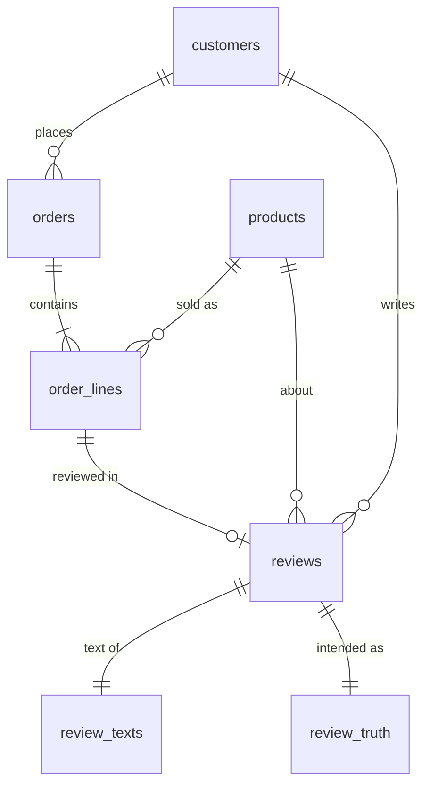

# Retail data model

This dataset replaces the flat review file with a small, realistic retail model. Customers buy products over time, and review a biased subset of what they bought. Tracked in #1; this note covers #2.



| Table | Key | What it holds |
|---|---|---|
| `customers` | `customer_id` `C0000001` | Fictional person: name, contact, address, country and locale, gender, date of birth, `signup_at` |
| `products` | `product_id` `P001` | The catalogue: SKU, name, category, description, list price, fuel type, launch date |
| `orders` | `order_id` `O000000001` | Who bought, when (`ordered_at`), `order_total` |
| `order_lines` | `order_line_id` `L0000000001` | One product on an order: quantity, unit price at the time, line total |
| `reviews` | `review_id` `R0000000001` (the digits of the order line it reviews) | Who reviewed which purchase, when (`reviewed_at`), and the stars. Nothing else. |
| `review_texts` | `review_id` + `prompt_hash` | The words of the review, their language, and what wrote them |
| `review_truth` | `review_id` | What the generator intended: hidden satisfaction, the aspect to focus on, the language asked for |

Schemas are pandera models in `src/retail_model/tabular_schemas.py`. Rules that span tables are in `src/retail_model/integrity.py`:

- Every foreign key resolves.
- Orders are placed on or after signup, and totals equal the sum of their lines.
- A review is by the customer who bought the line, about the product on that line.
- A review is written after the order it reviews.

## Decisions

- **String keys with a type prefix.** `C…`, `P…`, `O…`, `L…`, `R…` are self-describing in logs and joins, and cannot be mistaken for one another.
- **Reviews do not store customer facts.** Tenure and lifetime value are derived from `customers` and `orders` *as at the moment of each review*, using only data from before it (#5). That keeps them consistent and free of leakage for machine learning.
- **Timestamps, not dates.** `signup_at`, `ordered_at` and `reviewed_at` are naive UTC timestamps, so events on the same day still have an order.
- **Text in its own table.** Review text comes from a separate, slow, costly step: a model on Azure AI Foundry. It is cached by prompt, so the rest of the dataset can be regenerated without touching it.
- **Truth in its own table.** The generator knows how satisfied each reviewer really was. That is invaluable for measuring how well Jev recovers it, and fatal if it leaks into a feature. A separate table makes using it deliberate.

## Who leaves a review

People review when they are delighted or when something went wrong, rarely when an item was just fine. Each purchase gets a hidden satisfaction *s* in [0, 1], drawn around the product's own quality. The chance of a review is U-shaped over *s*:

```
p(review) = base_rate + extremity_rate × |2s − 1| ^ sharpness
```

| Parameter | Default | Effect |
|---|---|---|
| `base_rate` | 0.03 | Chance of reviewing a purchase that was exactly "fine" (*s* = 0.5) |
| `extremity_rate` | 0.45 | Extra chance at either extreme, so *s* = 0 or 1 gives 0.48 |
| `sharpness` | 2.5 | 1 is a V; higher keeps the middle flat and pushes reviews to the extremes |
| `rating_noise` | 0.35 | Standard deviation, in stars, of the noise between satisfaction and rating |

Stars follow from satisfaction: `round(1 + 4s + noise)`, clipped to 1–5. Parameters live in `ReviewPropensity` (`src/retail_model/review_propensity.py`).

The result is a review corpus that over-represents 1★ and 5★ against the purchases underneath it. That gap is realistic, and it is worth showing.

## Review text

Text is written from a **brief**: product, stars, how the customer feels, the aspect to focus on, the language and a length. See `src/review_writer`.

- **Azure AI Foundry** (`FoundryReviewWriter`) is the intended source. It uses the OpenAI-compatible `/openai/v1` API, so any chat deployment works. Configure `AZURE_FOUNDRY_ENDPOINT`, `AZURE_FOUNDRY_API_KEY` and `AZURE_FOUNDRY_DEPLOYMENT` in `.env`; they are never committed.
- **Templates** (`TemplateReviewWriter`) reuse the 168 hand-written reviews in `data/input/product_reviews.json`, matched on product and nearest rating. This is for offline runs and tests only. It is chosen explicitly, never as a silent fallback, and its rows say `text_source = "template"`. It writes English only.
- **Caching.** Texts are cached on `review_id` + `prompt_hash`. The hash covers the model and the rendered prompt, so the same seed reuses the same text: reproducible even though the model is not. A different writer or model, or a changed brief, writes afresh. Each row records `text_source`, `model` and `generated_at`. Failed calls are reported and retried on the next run, never cached.

## Catalogue and buying patterns

`reference_data/products.csv` is the committed catalogue: the 17 products from the original sample, with stable IDs, SKUs, descriptions, list prices, launch dates and a **fuel type**. The fuel type is what ties a grill to the consumables its owner keeps buying.

`retail_generator.generate_orders` simulates each customer in time order from signup. Every rate lives in `OrderPatterns` (`src/retail_generator/config.py`).

| Pattern | How |
|---|---|
| Seasonality | Order intensity × (1 + 0.6 cos(day − peak)): peaking mid-July in the north and mid-January in the Southern Hemisphere (Australia, New Zealand, South Africa, Brazil), plus bursts around Father's Day, Black Friday and Christmas. Orders arrive as a Poisson process thinned by this curve. |
| Grills | Rare: 35% of first orders, 10% of later orders until the customer owns one of ours, 2% after that. |
| Accessories | Occasional; a new grill brings a cover (45%) and a tool (50%) with it. |
| Fuel affinity | Pellets for pellet smokers; lump charcoal and lighters for charcoal. 55% of customers already own a grill from elsewhere and buy its fuel. |
| Replenishment | Fuel owners restock on a cycle (Gamma, mean 75 days), sooner in their barbecue season. |
| Prices | List price drifts up 4% a year; off-season orders are sometimes discounted 10–20%. Each line stores the price it was sold at. |
| Launches | Nothing is sold before the product's `launched_on`. |

Each customer draws from their own streams, so generating to a later date reproduces the earlier history exactly and continues it. IDs encode their parent: `O` + customer (7) + order (2), and `L` + order (9) + line (1). So the same order always has the same ID, however the dataset was built up.

## Reviews and point-in-time features

`retail_generator.generate_reviews` gives every order line a hidden satisfaction drawn from a Beta distribution around its product's quality. Quality is calibrated from the original reviews' mean stars as (★ − 1) / 4, so the BackYard King stays the dud it was. The line is then reviewed with the U-shaped propensity above.

- **When:** a review arrives a lognormal delay after the order (median 9 days), sooner when the customer is unhappy.
- **About what:** unhappy reviews focus on an *issue* using Jev's own problem-category labels (weighted by product category); happy ones on a *praise* aspect. `review_truth` records it, so Jev can later be scored against it.
- **Language:** about a third of customers in non-English-speaking countries ask for their own language. Only the Foundry writer honours it.
- **ID:** `R` + the reviewed line's digits.

Each line draws from its own stream, and a review belongs to the time slice its `reviewed_at` falls in, even when the order came earlier.

`customer_features.review_features` derives what was known about the customer **at the moment of each review**. Every feature goes through one helper, `point_in_time`: an as-of join on running totals that only admits events strictly before the review. That rules out target leakage for machine learning by construction, and a test appends huge future orders and reviews to prove no feature moves.

| Feature | At the review |
|---|---|
| `tenure_days` | Days since signup |
| `lifetime_revenue`, `order_count` | Orders placed before it |
| `days_since_last_order` | Since the most recent earlier order |
| `previous_reviews` | This customer's earlier reviews |
| `age`, `gender`, `country` | Age in whole years; the others are fixed |

The original `product_reviews.json` is retired as pipeline input. It remains the source for the template writer.

## Growing the dataset

`retail_generator.incremental` (and the `generate-data` command) grows the dataset in batches, each a file per table (`<table>/batch-NNNN.parquet`), recorded in `manifest.json`: the seed, the current `as_of`, a hash of the generator config, and every batch.

- **add-customers** takes the next customer numbers, signed up between the start and `as_of`, with all they bought and reviewed up to `as_of`.
- **advance** moves `as_of` on: existing customers keep ordering, and reviews land for purchases old and new.
- **fill-texts** retries review text that failed. Every batch also retries any still missing.

Each customer, order and review draws from its own random stream, so batching never changes the data. Two batches of customers equal one, and an advance equals generating straight to the later date (both tested). A customer's signup falls within the window as it stood when they were added.

Batches are atomic: files first, manifest last. `read_dataset` only reads batches the manifest lists, so an interrupted batch is invisible and is replaced on the next run. A different seed or config is refused, so every batch in a dataset is comparable.

## Assumptions

- Currency is not modelled; prices are plain numbers.
- One review per purchase at most. A second purchase of the same product can be reviewed separately.
- Countries are the twelve from the original sample. Faker has no Costa Rican or South African English locale, so those customers use `es_MX` and `zu_ZA` names and addresses (#3).
